M.Sc Nutrition and Dietetics. Business in Bhogpur, West Bengal. Hospital internships during B.Sc and M.Sc, six months each. Microsoft BI, Tally, Word, Excel, PowerPoint, and Notes. Open to work that puts generative and agentic AI inside nutrition science.

The console above is the profile. It plays on its own: portrait scan, glitch, rain, radar, signal bars, breach log, ticker, a color stills reel, and the sealed file — address, birth, academics, internships, tools, interests. The stills under it keep scrolling.

### Stills

[Nutrition_AI](https://github.com/surajkumardas20/Nutrition_AI) · [Nutrition_with_GenAI-AgenticAI](https://github.com/surajkumardas20/Nutrition_with_GenAI-AgenticAI) · [Nutrition-AI-Business-Model](https://github.com/surajkumardas20/Nutrition-AI-Business-Model) · [Sales-Analytics-System](https://github.com/surajkumardas20/Sales-Analytics-System) · [Assessment-Model](https://github.com/surajkumardas20/Assessment-Model) · [Giridhari-Traders](https://github.com/surajkumardas20/Giridhari-Traders)

[GitHub](https://github.com/surajkumardas20) · [X](https://x.com/_surajkumardas) · [Email](mailto:surajkumardaskrishna@gmail.com)

