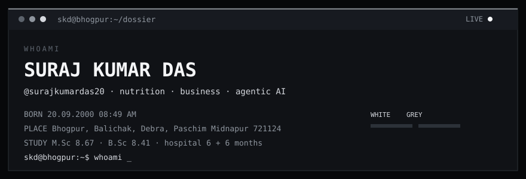

M.Sc Nutrition and Dietetics. Business. Hospital internships during B.Sc and M.Sc, six months each. Tools: Microsoft BI, Tally, Word, Excel, PowerPoint, Notes. Open to work that puts generative and agentic AI inside nutrition science.

The blocks below are the biodata, in a white-and-grey terminal. A scan line and signal meters run on the banner. The full command terminal (typing, rain, file lookup) is in this repository under `docs/`.

### Selected work

| Project | What it is |
| --- | --- |
| [Nutrition_AI](https://github.com/surajkumardas20/Nutrition_AI) | Patients, BMI, and SQL-powered health intelligence |
| [Nutrition_with_GenAI-AgenticAI](https://github.com/surajkumardas20/Nutrition_with_GenAI-AgenticAI) | Generative and agentic AI for nutrition science |
| [Nutrition-AI-Business-Model](https://github.com/surajkumardas20/Nutrition-AI-Business-Model) | AI, nutrition science, and business analytics |
| [Sales-Analytics-System](https://github.com/surajkumardas20/Sales-Analytics-System) | Python sales analytics |
| [Assessment-Model](https://github.com/surajkumardas20/Assessment-Model) | Worked examples for assessment |
| [Giridhari-Traders](https://github.com/surajkumardas20/Giridhari-Traders) | The trading venture |

[GitHub](https://github.com/surajkumardas20) · [X](https://x.com/_surajkumardas) · [Email](mailto:surajkumardaskrishna@gmail.com)

